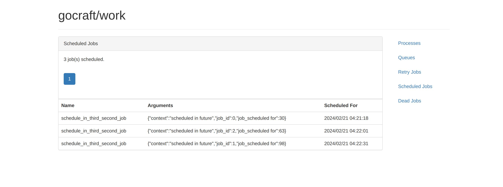

Proof of concept of golang background processor

## Introduction

This repository means to test the project [Go work](https://github.com/gocraft/work)

## Diagram for common jobs


## Scheduled jobs




## Running

Run dependencies
```sh
docker compose up -d
```

- Needs to configure .env first similiar to .env.example
```
    go run main.go
```

### Default host & port to access the app

- http://localhost:8080 # web server
- http://localhost:5040 # work UI
